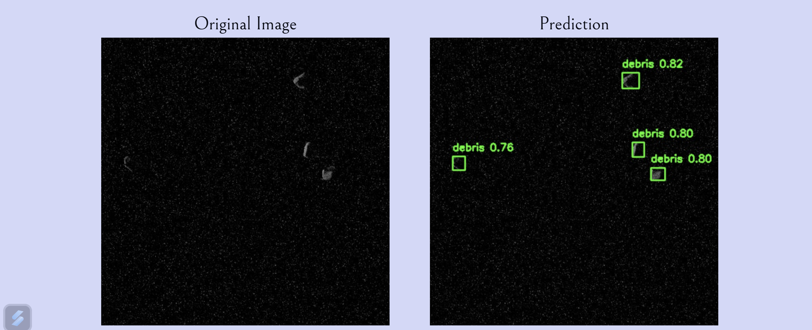

# Space Traveller

note: Due to the model being VERY HUGE in size (~110MB) we will provide a link `.zip` folder containing all the code including the machine learning model.




## Overview

Space Traveller is a machine learning model that utilized YOLO to detect space debris.

## Prerequisites

click [Here]() to download the full code.
Before running the Python script, ensure that you install required python libraries. You can typically do this using pip:

```bash
pip install -r requirements.txt
```

## Deployment

in VS Code (or your preferred code editor) run the following command in the terminal

```Python
py main.py
```

## Contributing

Pull requests are welcome. For major changes, please open an issue first
to discuss what you would like to change.

Please make sure to update tests as appropriate.
